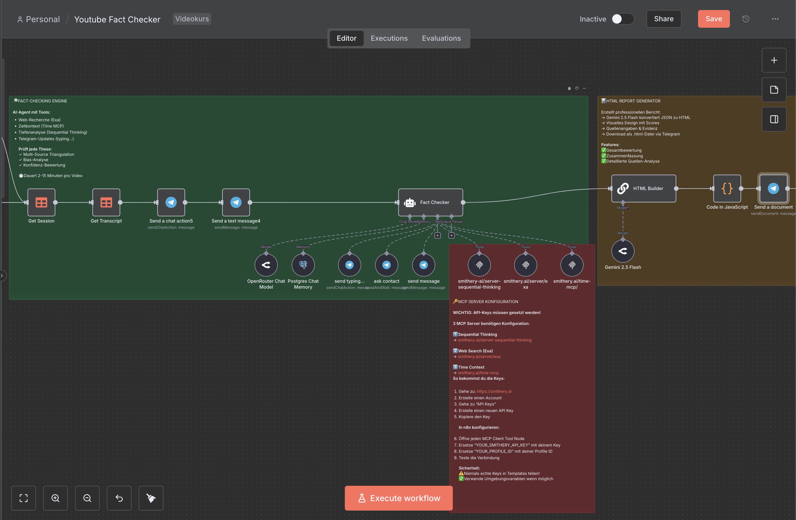

# YouTube Fact Checker Bot 🤖



[](https://opensource.org/licenses/MIT)
[](https://n8n.io)
[](https://telegram.org)

Ein intelligenter Faktenprüfungs-Bot, der YouTube-Videos automatisch analysiert und Behauptungen mit wissenschaftlichen Methoden überprüft.

## ✨ Features

- 🎥 **Automatische YouTube-Analyse** - Extrahiert Transkripte und Metadaten
- 🧠 **KI-gestützte Claim-Extraktion** - Identifiziert überprüfbare Behauptungen
- 🔍 **Multi-Source-Fact-Checking** - Triangulation mit unabhängigen Quellen
- 📊 **Bias-Erkennung** - Bewertet Quellen nach Interessen und Agenda
- 📄 **Professionelle HTML-Reports** - Visuelle Darstellung der Ergebnisse
- 💬 **Telegram-Integration** - Einfache Bedienung via Chat
- 🗄️ **Intelligentes Caching** - Vermeidet doppelte Analysen

## 🏗️ Workflow-Architektur

### Hauptkomponenten des Workflows:

1. **🔍 FACT-CHECKING ENGINE** (Grüner Bereich)
   - **AI-Agent mit Tools**: Web-Recherche (Exa), Zeitkontext (Time MCP), Tiefenanalyse (Sequential Thinking)
   - **Multi-Source Triangulation**: Prüft jede These mit unabhängigen Quellen
   - **Bias-Analyse & Konfidenz-Bewertung**: Wissenschaftliche Methoden
   - **Dauer**: 2-15 Minuten pro Video

2. **🔑 MCP SERVER KONFIGURATION** (Roter Hinweis)
   - **3 MCP Server** benötigen API-Key Konfiguration
   - **Sequential Thinking**: `smithery-ai/server-sequential-thinking`
   - **Web Search (Exa)**: `smithery.ai/server/exa`
   - **Time Context**: `smithery.ai/time-mcp`
   - **Setup**: [Smithery.ai](https://smithery.ai) → API Keys → Konfiguration in n8n

3. **📊 HTML REPORT GENERATOR** (Oranger Bereich)
   - **Gemini 2.5 Flash**: Konvertiert JSON zu HTML
   - **Visuelles Design**: Scores, Quellenangaben & Evidenz
   - **Download**: .html-Datei via Telegram
   - **Features**: Gesamtbewertung, Zusammenfassung, Detaillierte Quellen-Analyse

## 🚀 Quick Start

1. **Repository klonen**
   ```bash
   git clone https://github.com/Silverstar187/youtube-fact-checker.git
   cd youtube-fact-checker
   ```

2. **n8n Workflow importieren**
   - Öffne deine n8n-Instanz
   - Importiere `White_Rabbit_Fact_Checker Bot.json`
   - Konfiguriere alle API-Keys

3. **Telegram Bot starten**
   - Sende `/start` an den Bot
   - Sende einen YouTube-Link
   - Erhalte detaillierten Fact-Check-Report

## 📖 Dokumentation

- **[Vollständige Anleitung](Anleitung.md)** - Detaillierte Setup- und Konfigurationsanweisungen
- **[API-Dokumentation](docs/api.md)** - Technische Referenz
- **[Troubleshooting](docs/troubleshooting.md)** - Häufige Probleme und Lösungen

## 🛠️ Technologie-Stack

- **n8n** - Workflow-Orchestrierung
- **Telegram Bot API** - Benutzerinterface
- **OpenRouter** - KI-Modelle (GPT-5, Mistral, Gemini)
- **Supadata** - YouTube-Integration
- **Smithery.ai** - MCP Server für Web-Recherche
- **PostgreSQL** - Datenbank und Caching

## 🔒 Sicherheit

- ✅ Alle API-Keys aus Template entfernt
- ✅ Platzhalter für sichere Konfiguration
- ✅ Keine sensiblen Daten im Repository

## 📄 Lizenz

MIT License - siehe [LICENSE](LICENSE) für Details.

## 🤝 Beitragen

Wir freuen uns über Beiträge! Bitte erstelle ein Issue oder Pull Request.

## ⚠️ Disclaimer

Dieser Bot ist ein Tool zur Unterstützung der Faktenprüfung. Die Ergebnisse sind nicht als absolute Wahrheit zu verstehen und sollten immer kritisch hinterfragt werden.
